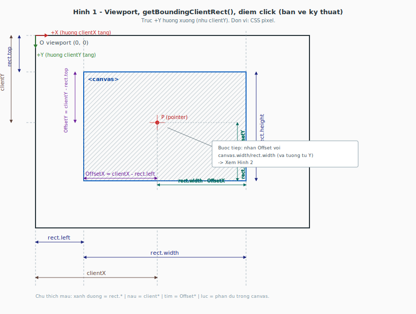
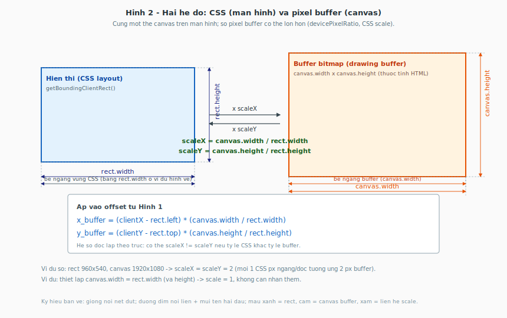

# Click trên Canvas: từ màn hình → tọa độ trong game / 3D

Tài liệu này giải thích cách dùng `getBoundingClientRect()` và tỷ lệ `canvas.width` / `rect.width` để map chuột từ không gian trình duyệt sang pixel nội bộ của canvas.

Hai **bản vẽ kỹ thuật** (SVG) trong `docs/figures/` dùng đường dim, gióng nét đứt và mũi tên hai đầu giống bản vẽ CAD — mở file `.svg` trực tiếp trong trình duyệt nếu Markdown preview không hiển thị ảnh.

---

## 1. Thuật ngữ (mốc đo)

| Ký hiệu | Ý nghĩa |
|--------|---------|
| **clientX** | Khoảng cách từ điểm click đến **mép trái** cửa sổ trình duyệt (viewport). |
| **clientY** | Khoảng cách từ điểm click đến **mép trên** cửa sổ trình duyệt. |
| **rect** | Kết quả `canvas.getBoundingClientRect()` — “khung bao” của phần tử canvas trên màn hình. |
| **rect.left** | Từ mép trái viewport đến mép trái canvas. |
| **rect.top** | Từ mép trên viewport đến mép trên canvas. |
| **rect.width** | Chiều rộng **hiển thị** của canvas (đơn vị CSS px trên màn hình). |
| **rect.height** | Chiều cao hiển thị tương tự. |

### Bản vẽ 1 — Viewport, canvas, điểm click (đủ dim)



**Các dim trên hình (tóm tắt)**

| Màu / vị trí | Dim |
|--------------|-----|
| Xanh dương | `rect.left`, `rect.top`, `rect.width`, `rect.height` |
| Nâu | `clientX`, `clientY` (từ gốc viewport đến điểm P) |
| Tím | `OffsetX = clientX − rect.left`, `OffsetY = clientY − rect.top` |
| Lục | `rect.width − OffsetX`, `rect.height − OffsetY` (phần còn lại trong canvas tính từ P) |

Trục **+Y hướng xuống** (giống `clientY` trong trình duyệt).

---

## 2. Bước 1 — Offset “thô” (trên màn hình)

Dời mốc từ góc viewport về **góc trái-trên của canvas**:

```
OffsetX = clientX − rect.left
OffsetY = clientY − rect.top
```

**Ý nghĩa:** Vị trí chuột nếu đo từ mép canvas trên mặt phẳng màn hình (cùng đơn vị với `rect.width` / `rect.height` — thường là CSS pixel).

---

## 3. Bước 2 — Tọa độ “thật” trong buffer / game / 3D

Điểm dễ nhầm: **kích thước vẽ trên màn hình** khác **độ phân giải nội bộ** của canvas.

| Thuộc tính | Ý nghĩa |
|------------|---------|
| **canvas.width** / **canvas.height** | Số pixel trong **buffer** (ví dụ 1920×1080). |
| **rect.width** / **rect.height** | Kích thước **ô** canvas bạn nhìn thấy (ví dụ 960×540 nếu CSS scale một nửa). |

### Bản vẽ 2 — Hai hệ đo: CSS ↔ buffer (đủ dim + ví dụ số)



**Các dim trên hình**

- Khối trái: `rect.width`, `rect.height` + dim tổng bề ngang vùng CSS.  
- Khối phải: `canvas.width`, `canvas.height` + dim tổng bề ngang buffer.  
- Khoảng giữa: nhân `scaleX`, `scaleY` và công thức đầy đủ trong khung chú thích.

Công thức đầy đủ:

$$
x_{3D} = (clientX - rect.left) \times \frac{canvas.width}{rect.width}
$$

$$
y_{3D} = (clientY - rect.top) \times \frac{canvas.height}{rect.height}
$$

*(Tuỳ pipeline Three.js, bạn có thể cần lật trục Y hoặc chuẩn hoá NDC; phần trên là phần scale giữa CSS và pixel nội bộ.)*

---

## 4. Luồng gọn trong một dòng

1. Lấy `rect = canvas.getBoundingClientRect()`.  
2. Offset màn hình: `(clientX - rect.left, clientY - rect.top)`.  
3. Nhân tỷ lệ: nhân với `canvas.width/rect.width` và `canvas.height/rect.height` để ra pixel buffer / input cho raycaster.

Nhìn **bản vẽ 1** để không nhầm `client*` với offset trong canvas; nhìn **bản vẽ 2** để không nhầm `rect.*` với `canvas.*`.
